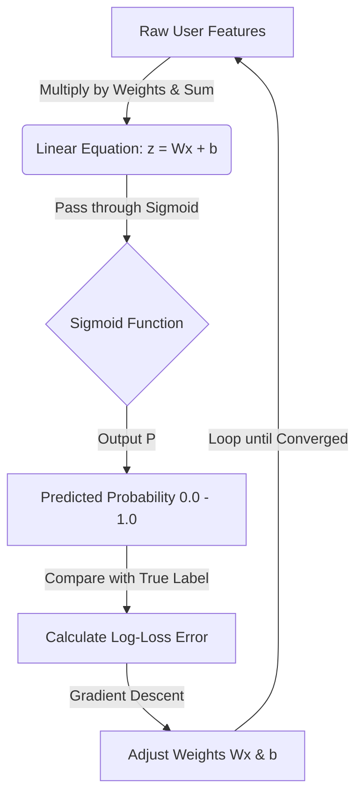

# Logistic Regression in Churn Prediction

This guide provides a medium-level deep dive into how Logistic Regression was applied in our Shopping Extension Churn model, along with expected interview and counter-questions.

---

## 1. Core Concept Overview

**What is it?**
Logistic Regression is a foundational classification algorithm used to predict the probability of a binary outcome (e.g., Churn vs. Retain).

Instead of fitting a straight line through data points (like Linear Regression), Logistic Regression uses the **Sigmoid Function** (an S-shaped curve) to squash the output of a linear equation to a value strictly between 0 and 1.

If the probability is $P(Churn) > 0.5$, we classify the user as a churner. If $P(Churn) \le 0.5$, we classify them as retained.

**How does it learn?** (Step-by-Step)

1. **Initialization:** The model starts with random weights (beta coefficients) for each feature (e.g., `amount_saved`, `coupon_attempts`).
2. **Linear Combination:** For a given user, it multiplies their feature values by these weights and sums them up (similar to $y = mx + b$).
3. **Sigmoid Transformation:** It passes this sum through the Sigmoid function, transforming the raw number into a probability between 0 and 1.
4. **Log-Loss Calculation:** It compares this predicted probability against the actual label (1 for Churn, 0 for Retain). The difference is calculated using the **Binary Cross-Entropy (Log-Loss)** cost function, which heavily penalizes the model if it is confident but wrong.
5. **Gradient Descent:** The model uses optimization (calculating the gradient/derivative of the loss function) to determine which direction to adjust the weights to lower the total error.
6. **Iteration:** It repeats this process over many epochs until the weights converge on the lowest possible error.

---

## 2. Application in Our Churn Project

In our shopping extension project, we used Logistic Regression as our baseline model.

- **The Goal:** To understand the _linear_ relationship between our engineered features (like `amount_saved`, `cashback_earned`, and `coupon_success_rate`) and the probability of a user uninstalling the extension within 90 days.
- **The Baseline Advantage:** We used it first because of its high interpretability. By looking at the coefficients, we can categorically say, "For every $1 increase in `amount_saved`, the log-odds of a user churning decreases by X amount."
- **Performance:** It achieved a ROC-AUC of ~0.67 on our synthetic data. While decent, it struggled to capture complex "frustration" interactions (like high attempts combined with low successes), which is why we ultimately moved to Random Forest.

---

## 3. Medium-Level Interview & Counter Questions

> If you present this project, expect variations of the following questions from a senior data scientist or hiring manager.

### Q1: "Why did you use Logistic Regression instead of Linear Regression to predict churn?"

**Answer:**
Linear Regression predicts continuous values (like home prices) and can output predictions less than 0 or greater than 1, which makes no sense for a probability. It is also highly sensitive to outliers. Logistic Regression solves this by wrapping the linear equation in a Sigmoid function, formally restricting the output to a valid probability range between 0 and 1. Furthermore, we optimize Logistic Regression using Log-Loss, because using Mean Squared Error (MSE) on probabilities creates a non-convex function with many local minima, making gradient descent mathematically prohibitive.

### Q2: "Churn datasets are notoriously imbalanced (e.g., 90% retain, 10% churn). How did you handle this, and why shouldn't we use standard Accuracy to evaluate the model?"

**Answer:**
If 90% of our users retain, a "dumb" model that simply predicts "Retain" for every single user will be 90% accurate, but entirely useless for our business objective.

To handle this in the data split, I ensure I use a **stratified split** (`stratify=y`) so the train and test sets have the exact same proportion of churners. During evaluation, I rely on **Precision, Recall, F1-Score, and ROC-AUC**.

- **Precision** tells me: out of all the users the model _flagged_ as churners, how many actually churned? (Crucial if targeted retention campaigns are expensive).
- **Recall** tells me: out of _all actual_ churners in our dataset, what percentage did the model successfully catch?
- **F1-Score** is the harmonic mean of Precision and Recall, giving a balanced metric when you care equally about false positives and false negatives.
- **ROC-AUC** calculates the model's ability to distinguish between classes independent of a strict 0.5 classification threshold.
  _(Bonus point: You can also mention using the `class_weight='balanced'` parameter in `sklearn` to penalize the model more for misclassifying the minority churn class)._

### Q3: "In your project, what does it mean if the coefficient for the `cashback_earned` feature is negative?"

**Answer:**
In Logistic Regression, coefficients represent the change in the _log-odds_ of the target variable for a one-unit change in the predictor. If `cashback_earned` has a negative coefficient, it indicates a negative correlation with our target (Churn = 1). Practically, it means that as a user earns more cashback, their odds of churning decrease.

### Q4: "Did you check for Multicollinearity between your features? Why does it matter for Logistic Regression?"

**Answer:**
Yes, I plotted a correlation heatmap during the EDA phase. Multicollinearity occurs when two independent variables (e.g., `coupon_attempts` and `coupon_successes`) are highly correlated with each other.
While multicollinearity won't necessarily hurt the overall predictive power of the model, it makes the specific beta coefficients incredibly unstable and uninterpretable. If we are using Logistic Regression specifically to understand _which_ feature drives churn, multicollinearity ruins our ability to trust those coefficient weights.

### Q5: "What are the limitations of Logistic Regression? When does it fail?"

**Answer:**
Its largest limitation is that it assumes a strictly linear relationship between the independent variables and the log-odds of the dependent variable. It cannot natively capture complex, non-linear interactions without intense manual feature engineering. For example, in our extension, a user attempting 50 coupons and succeeding 0 times causes massive frustration and churn. A linear model struggles to capture that conditional relationship natively, which is exactly why our subsequent Random Forest model outperformed it.
